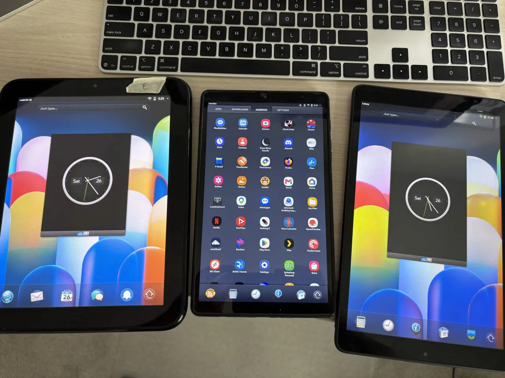

# Lunacy

**Run legacy webOS apps on modern Android phones and tablets, inside a shell that looks and
feels like webOS.**

webOS apps were HTML and JavaScript. They loaded their framework (Enyo or Mojo) from the OS,
ran as cards in the Luna system shell, and talked to the system over the Luna service bus
(`palm://…`). The devices are more than a decade old, but the apps are still good. Most of
them never needed Palm's hardware. They needed Palm's *contract*.

Lunacy provides that contract on Android.

## How it works

Lunacy reimplements the contract, not the machine:

1. **A simulated Luna shell.** A native Android UI that recreates the webOS experience: card
   view, gestures, launcher, notification banners and dashboard. None of Palm's code runs.
   It only has to look and behave like webOS, and it has to feel right.
2. **Modernized frameworks.** Apps don't ship their framework; they load it from
   `/usr/palm/frameworks/…` and trust the OS to provide it. Lunacy supplies a fork of
   [Enyo 1.0](https://github.com/enyojs/enyo-1.0) (Apache 2.0), fixed to run on a modern
   Chromium renderer. One fix in the library covers every app built on it.
3. **Apps as cards.** Each app runs unmodified in its own WebView card, on its own origin.
4. **A simulated service bus.** `palm://` calls are routed either to Lunacy itself (app
   manager, db8, shell services) or to the equivalent Android feature (connectivity, power,
   locale, notifications, intents).

Enyo was designed to scale from phone to tablet: its flex layouts and panels fill whatever
screen they are given. So most apps run at the device's real size, on both phones and tablets.

## What it comes first

The look and feel is the TouchPad's, measured on one: how a card opens, how the launcher
moves, what a loading card does, where every pixel of the shell sits. That fidelity is the
project's first rule, ahead of speed or simplicity, and every difference the engine forces is
measured and written down ([Docs/luna-deltas.md](Docs/luna-deltas.md)).

## What it is not

- **Not an emulator.** No Palm binaries, no system image, no QEMU.
- **Not a per-app porting kit.** No app is patched. Every fix goes into the frameworks or a
  global compatibility layer that treats all apps alike.
- **Not LuneOS.** [LuneOS](https://github.com/webOS-ports) is a full OS. Lunacy is an app on
  the Android you already have.

## Scope and order

1. Enyo 1 apps (webOS 3.x, TouchPad era), and Enyo 2 apps, which bundle their own framework
   and need only the compatibility layer and the bus
2. Mojo apps (webOS 1.x–2.x)
3. JS (Node) services that ship with apps
4. PDK native apps

Apps come from webOS Archive's [catalogue](https://appcatalog.webosarchive.org), through the
TouchPad's own App Catalog. It is itself an Enyo app, so Lunacy bundles it and it runs inside
Lunacy like any other card. The shell's styling target is LunaCE.

## Platform

Lunacy supports Android 5.0.1 through Android 14 on Tablets. Newer Android versions to follow.
- Can run as the default Android Launcher (optional)
- Pair it with the optional webOS-style keyboard
- Launches Mojo, Enyo and Android apps

## Using it

Lunacy is sideloaded: there is no store listing.

1. **Allow unknown sources.** Settings → Security → Unknown sources. (On Android 8 and later
   this is asked for per app, when you open the APK.)
2. **Install the APK for your device** - `AndroidLuna-arm64.apk` for a 64-bit device,
   `AndroidLuna-arm32.apk` for a 32-bit one (every Android 5 device; if unsure, try the
   64-bit one first, which a 32-bit device refuses). Copy it to the device and tap it, or
   `adb install`. Open **Lunacy** from the Android launcher. The card view, the launcher and the bundled apps are
   there; **App Catalog**, on the launcher's Downloads tab, is where the apps come from.
3. **Optional: the webOS keyboard.** Install `LunaKeyboard.apk`, open **LunaKeyboard** and
   use its two buttons - switch it on in Android's settings, then choose it while a text field
   has focus. Android's own keyboard stays installed; switching back is the same picker.
4. **Optional: Exhibition as the screen saver.** Settings → Display → Daydream, turn it on and
   pick **Lunacy Exhibition**. Whenever Android would sleep, Lunacy shows webOS's Exhibition
   mode instead. Which face it shows is chosen in Lunacy's own Exhibition app, on the Settings
   tab. Lunacy never turns Daydream on by itself.

Building from source is [BUILDING.md](BUILDING.md).

## Status

In *early* development; 0.3.0 is the current release. The Luna shell (card view with card
stacks, launcher, status bar, notifications, Just Type) and Enyo and Mojo apps such as the App
Catalog run on an Android 5 tablet, measured against a real TouchPad. Newer Android installs it
without workarounds (tested on Android 14). See [Docs/roadmap.md](Docs/roadmap.md)
for where things stand.

## Documentation

- [BUILDING.md](BUILDING.md): what you need and how to build both APKs
- [Docs/architecture.md](Docs/architecture.md): components and boundaries
- [Docs/roadmap.md](Docs/roadmap.md): phases and exit criteria
- [Docs/fix-log.md](Docs/fix-log.md): every compatibility fix, the layer it landed in, and how each app fares
- [Docs/db8.md](Docs/db8.md): webOS's database, and what Lunacy answers for it
- [Docs/lessons.md](Docs/lessons.md): the rules this and earlier attempts have paid for
- [Docs/mojo.md](Docs/mojo.md): how Mojo is packaged, and what it takes to run it
- [Docs/spike-1.md](Docs/spike-1.md): stock Enyo on an Android 5 tablet, first results
- [Docs/android5-setup.md](Docs/android5-setup.md): what is done to an Android 5 device
- [Docs/dev-workflow.md](Docs/dev-workflow.md): building, running, and checking against a TouchPad
- [Docs/luna-shell-reference.md](Docs/luna-shell-reference.md): LunaCE shell spec, from its source
- [Docs/luna-deltas.md](Docs/luna-deltas.md): where Lunacy still differs from LunaCE, as a work list with pointers
- [Docs/related-projects.md](Docs/related-projects.md): the wider webOS preservation landscape

## Companion apps

- [LunaKeyboard/](LunaKeyboard/README.md): an optional Android input method that looks and behaves
  like the TouchPad's keyboard, scroll ball and all. A separate APK that shares nothing with
  Lunacy and works in any Android app.

Part of the [webOS Archive](https://www.webosarchive.org) family of projects.
